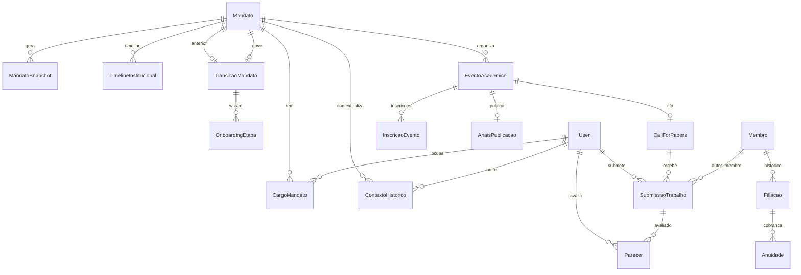

# Schema de Domínio — AssApp

> Diagrama ER das entidades centrais da pesquisa PIPE.  
> Fonte: [`prisma/schema.prisma`](../../prisma/schema.prisma) e `backend/*/models.py`  
> **Análise de vínculos e gaps (ação futura):** [`docs/referencia/ANALISE_VINCULOS_MODULOS_E_TENANCY.md`](../referencia/ANALISE_VINCULOS_MODULOS_E_TENANCY.md)

---

## Entidades Centrais (PIPE)



---

## Mandato — Ciclo de Vida

```
planejado → ativo → transicao → encerrado → arquivado
                ↑                    │
                └──── onboarding ────┘
```

| Status | Descrição |
|--------|-----------|
| `planejado` | Mandato futuro, cargos podem ser definidos |
| `ativo` | Mandato em exercício (apenas 1 por tenant) |
| `transicao` | Handoff em andamento com wizard |
| `encerrado` | Finalizado com snapshot |
| `arquivado` | Somente leitura, preservado para pesquisa |

---

## ContextoHistorico — Preservação Ativa (H1)

Cada registro responde às perguntas:

| Campo | Pergunta |
|-------|----------|
| `autor` | Quem registrou/decidiu? |
| `decisao` | O que foi decidido? |
| `motivo` | Por quê? |
| `mandato` | Em qual gestão? |
| `entidade_tipo` + `entidade_id` | Sobre o quê? |
| `tags` | Como encontrar depois? |

---

## EventoAcademico — Fluxo Integrado (H3)

```
rascunho
  → inscricoes_abertas
  → cfp_aberto
  → em_avaliacao
  → encerrado
  → anais_publicados
```

---

## Multi-Tenancy

| Schema | Apps |
|--------|------|
| `public` | tenants, domains, adminpanel, payments |
| `sistema` | superadmin (tenant especial) |
| `{associacao}` | mandatos, memoria, eventos, membros, finance, ... |

---

## Índices Críticos

| Tabela | Índice | Motivo |
|--------|--------|--------|
| `mandatos_mandato` | `(status)` | Busca mandato ativo |
| `memoria_contexto_historico` | `(mandato_id, tipo)` | Timeline por mandato |
| `eventos_submissao_trabalho` | `(cfp_id, status)` | Dashboard CFP |
| `membros_filiacao` | `(membro_id, status)` | Quadro de associados |

---

Ver também: [`docs/modulos/MANDATOS.md`](MANDATOS.md)
